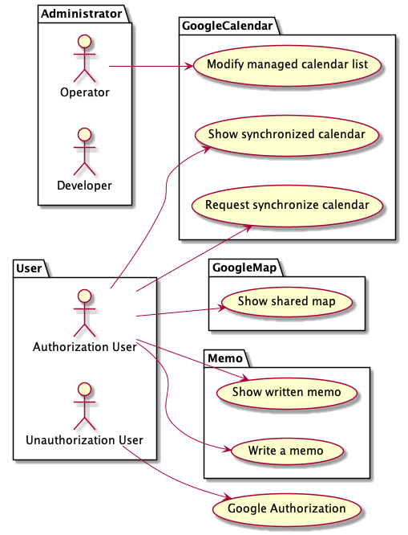

# down-to-love

## Introduction for a "down-to-love"

This project was launched to overcome the long distance relationship in the COVID-19 situation.

## Features

- Google Calendar Sharing
- Google Map Sharing
- (TBD) Gallery Time lapse
- Memo what we want to do together
- Management a long-term timeline

## Language & Framework

### Front

- Language: JavaScript
- Framework: React.js(CRA), Nest.js(Backend For Front)

### Backend

- Language: Kotlin
- Framework: SpringBoot 2.6.5(or 3.0.0 SNAPSHOT)
